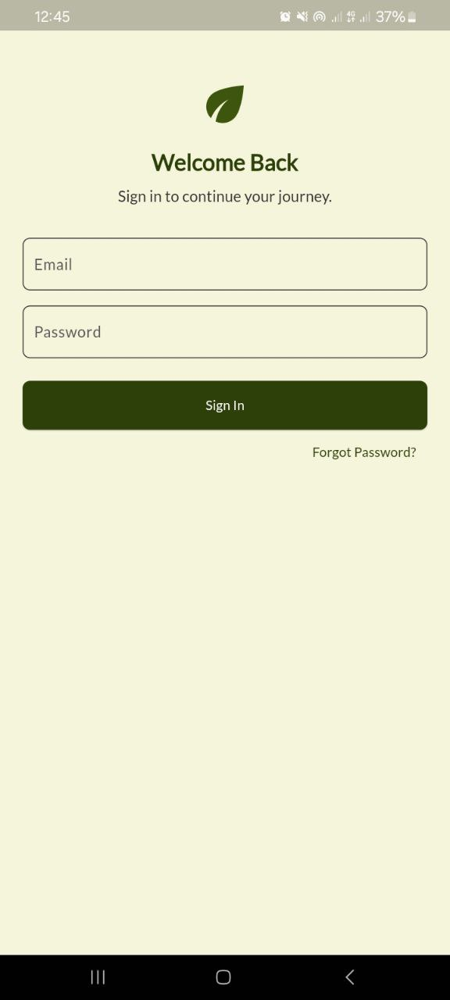
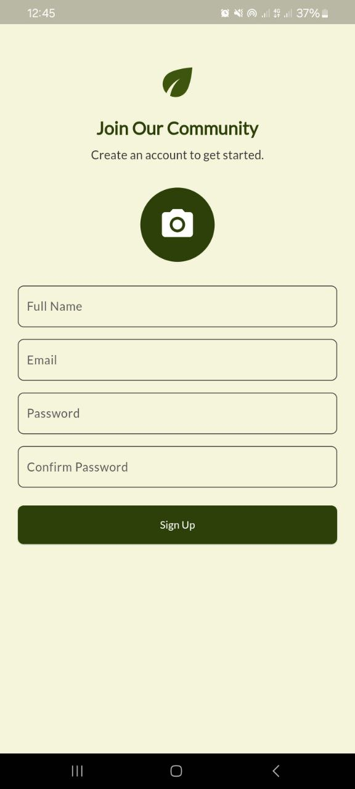
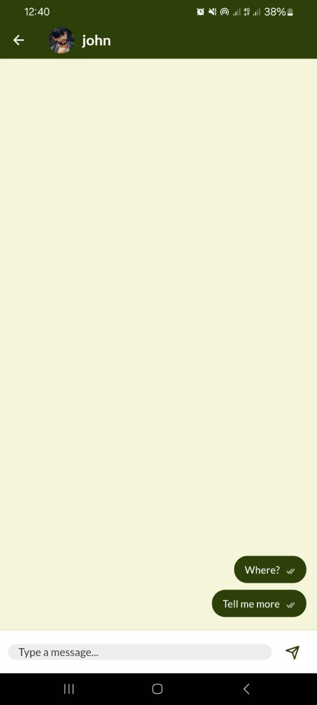
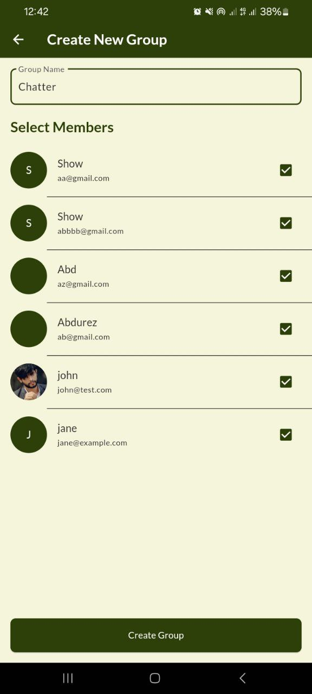
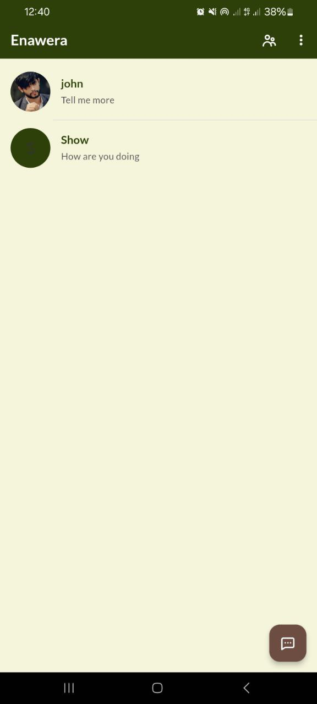
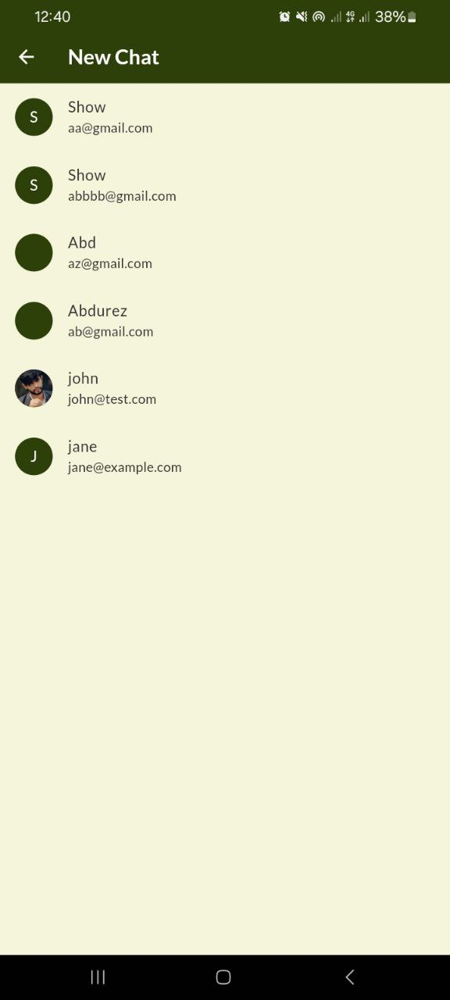
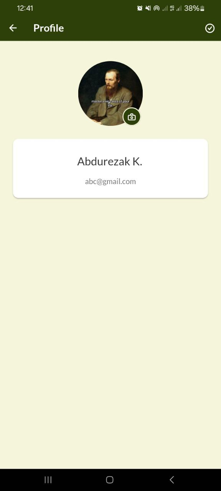

# Enawera – Flutter Chat App

A modern, real-time chat application built with Flutter and Firebase.  
This project demonstrates clean architecture, provider-based state management, and a responsive UI.

## 🚀 Features

- **Authentication:** Sign up, sign in, and password recovery (email/SMS)
- **Chat:** Real-time messaging, group chats, media sharing (images, files, voice notes)
- **Contacts:** Searchable user list, start new chats, create groups
- **Profile & Settings:** Edit profile, manage privacy, notification preferences
- **Notifications:** Push and in-app notifications for new messages
- **Dark Mode:** Optional dark/light theme
- **Security:** End-to-end encryption, secure authentication

Screenshots:
<p float="left">
  

  
  
  
  
  
  
</p>


## 🛠️ Tech Stack

- **Frontend:** Flutter (Dart)
- **Backend:** Firebase (Auth, Firestore)
- **State Management:** Provider
- **Local Storage:** get_storage

## 📦 Getting Started

1. **Clone the repo:**
   ```sh
   git clone https://github.com/your-username/your-repo.git
   cd your-repo
